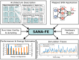

Welcome to SANA-FE's Documentation
=======================================

Architecting new neuromorphic chips involves several design decisions that can
affect overall system power consumption and performance. Architecture models can
be used to estimate the impact of different design decisions and thus inform
decision-making and exploration. SANA-FE (Simulating Advanced Neuromorphic
Architectures for Fast Exploration) is an open-source tool developed in a
collaboration between UT Austin and Sandia National Laboratories (SNL) to
rapidly and accurately model and simulate the energy and performance of
different neuromorphic hardware platforms.

SANA-FE requires a description of the architecture you want to simulate, a
specification of the spiking neural network (SNN) application you wish to max
and execute. Optionally, you can also provide shared library hardware plugins
and simulation configuration. SANA-FE will simulate the given architecture and
give performane and energy estimates. Optionally, SANA-FE will generate detailed
hardware traces.

The SANA-FE kernel is primarily written in C++, but uses PyBind11 to generate
Python interfaces. SANA-FE can alternatively be used as a standalone C++
simulator. For more using SANA-FE without Python, visit the project repository
homepage at:
https://github.com/SLAM-Lab/SANA-FE

This library implements a Python interface, allowing you to specify and
manipulate mapped SNNs, control/script simulations, and easily receive
prediction outputs/traces.

If you find this project useful, please consider starring ⭐ it.

Quick-start
===========

To install SANA-FE from PyPI, run the following

.. code-block:: bash
   python
   pip install sanafe

If you would rather install the latest SANA-FE from source, run

.. code-block:: bash
   git clone https://github.com/SLAM-Lab/SANA-FE sana-fe
   cd sana-fe
   pip install .

You can test your SANA-FE installation by running the following command

.. code-block:: bash
   python -c "import sanafe; \
   arch=sanafe.load_arch('arch/example.yaml'); c=sanafe.SpikingChip(arch); \
   c.load(sanafe.load_net('snn/example.yaml',arch)); c.sim(100)"

If this ran successfully, you should see the following print on the console

.. code-block::
   Executed steps: [100/100]

For more examples of how to use SANA-FE, we have provided a set of Jupyter
notebooks at:
https://github.com/SLAM-Lab/SANA-FE/blob/main/tutorial

These tutorials can be run locally or using Google Colab.

.. toctree::
   :maxdepth: 2
   :caption: Contents:

   introduction
   api

Indices and tables
==================

* :ref:`genindex`
* :ref:`modindex`
* :ref:`search`

Acknowledgement
===============

Copyright (c) 2025 - The University of Texas at Austin
This work was produced under contract #2317831 to National Technology and
Engineering Solutions of Sandia, LLC which is under contract
No. DE-NA0003525 with the U.S. Department of Energy.